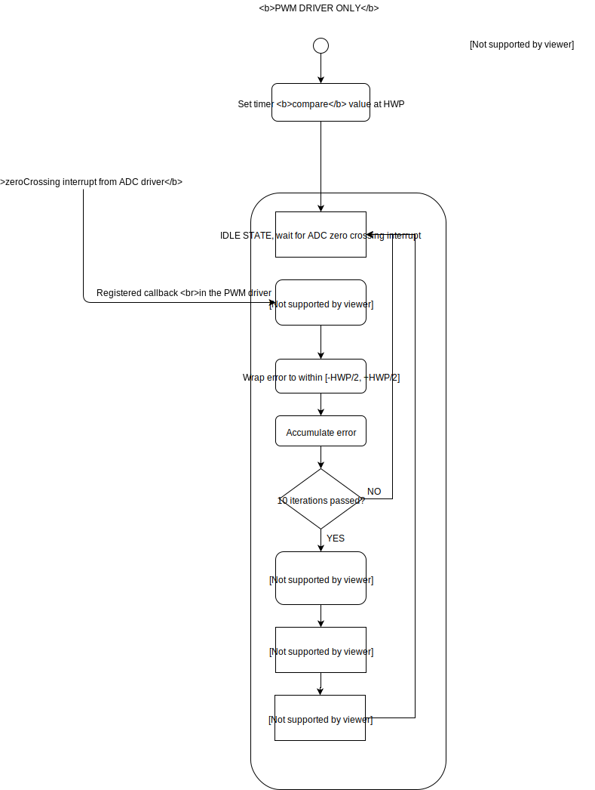
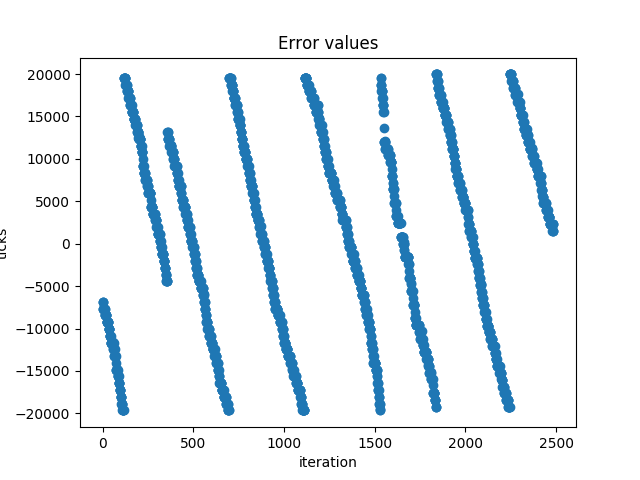
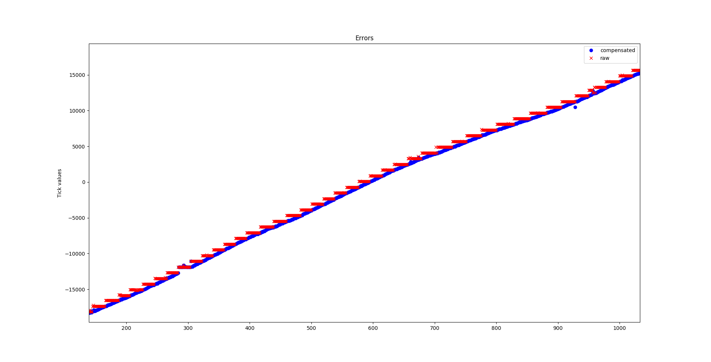

# The Crownstone Dimmer

## Dimming in light bulbs

Dimming in the context of light bulbs refers to the process of reducing the supply of power to a bulb in a controlled manner to have reduced light intensity. It is usually performed using Pulse Width Modulation (PWM) by *gating* the input mains supply i.e. by switching off the input to the bulb for a certain fraction of every cycle of the sine wave. The period for which the supply is **on**, expressed as a percentage of the wave's time period, is called the *duty cycle*.

Dimming is generally one of [two kinds](https://www.lamps-on-line.com/leading-trailing-edge-led-dimmers):
- Leading-edge dimming: The leading edge of every half wave is *chopped* to zero for a period determined by the duty cycle.
- Trailing-edge dimming: The trailing edge of every half wave is chopped to zero

Essentially, through PWM, power supply to the bulb is lowered in proportion to the duty cycle, and hence the timing of the gating switch plays a very important role in terms of providing a consistent light intensity level (the bulb flickers if the switch isn't tightly synchronized and/or in phase with the input supply.)

## Dimming in the Crownstone

Crownstones use trailing-edge dimming (see [this](https://github.com/crownstone/bluenet/blob/master/docs/DIMMER.md) document for reference.) [Perhaps this is subject to change, depending on the load; **must verify**]

*Zero-crossing* refers to a voltage transition from either a negative value to a positive value or vice versa. Hence, in a sine wave, there are two voltage zero crossings per cycle. This information is very important given the PWM gating has to be synced accordingly.

The Crownstone implementation involves interrupts, timers, and an ADC (on an [nRF52382 SoC](https://www.nordicsemi.com/Products/Low-power-short-range-wireless/nRF52832)). The dimming algorithms hence rely more on how the control software is written subject to some hardware constraints (for instance, sampling rate.)

### Implementation in a nutshell

The ADC detects zero crossings, its driver conveys this information to the PWM driver, and the PWM driver accordingly tries to sync with the frequency of the input supply and handles the duty cycle-based gating of power supply to the plug outlet connected to the Crownstone.

### Breaking it down

- The input voltage is sampled using the ADC and an interrupt is called once the sampled value is ready (done)
- An interleaved buffer is used for storing the values of the input voltage samples. The [ADC driver internally handles which buffer to write to](https://github.com/crownstone/bluenet/blob/master/docs/ADC.md) based on the sequence of the input samples. (The ADC is used for measuring the current values as well in order to calculate the instantaneous power being consumed by the Crownstone.)
- When the ADC detects a *rising* zero crossing (i.e. negative to positive voltage transition) it raises a different interrupt (specific to the zero crossing detection) that is handled by the PWM driver. (Based on the settings of the ADC driver, it could also be the *falling* zero crossings.)
- The PWM driver has its own timer which is configured using the nRF SDK's *shortcuts* (i.e. resetting of the clock when the [COMPARE](https://infocenter.nordicsemi.com/index.jsp?topic=%2Fcom.nordic.infocenter.nrf52832.ps.v1.1%2Ftimer.html&cp=3_1_0_23_1&anchor=concept_yry_3pp_sr) event is triggered.) 
  - When the zero crossing interrupt is handled by the PWM driver, the *error* between the actual elapsed timer value and the expected timer value is used to calculate the next PWM *timer compare* value. 
  - Since the input supply is expected to be periodic (50/60 Hz) the time duration between two successive cycles (ergo, two zero crossings) is known to a reasonable approximation. 
  - However, in practice, the time duration may not be very exact and is prone to varying (and drift), and hence an algorithm needs to be run on the time difference between the actual zero crossing and the expected zero crossing such that the error is reduced to zero (or minimized) as far as possible
- Based on the knowledge of the error and the frequency of the input wave, the next timer compare event's value is calculated and the timer is reset so that it starts counting from 0 again till the next compare event's value
- If the error isn't reduced carefully the dimming quality gets adversely affected (the bulb flickers) since trailing- and leading-edge dimming require that the frequency be exactly known (the gating of the input voltage needs to be very precise temporally so as to not be visible to the naked eye; a phase mismatch shows up very clearly in the form of flickering of the bulb)
- The nRF SDK's [Programmable Peripheral Interconnect (PPI) channels](https://infocenter.nordicsemi.com/index.jsp?topic=%2Fcom.nordic.infocenter.nrf52832.ps.v1.1%2Fppi.html&cp=3_1_0_21&anchor=concept_sxf_21l_1s) are used by the PWM timer to gate the input wave and perform duty cycle transitions as quickly as possible without making direct use of the CPU
- Using the PPI channels, we need to generate a *switch* signal for gating the input wave, and the frequency of this switch signal needs to be double the frequency of the input wave (since we need to gate both the positive and negative half-cycles of the sine wave as per the duty cycle value set by the user)

<!-- TODO: Write about PPIs, the PWM timer, zero crossing interrupts, clearing and setting of interrupts, etc. Essentially the infra behind the dimming algorithm implementation -->

----
## Dimming algorithms

Ideally, the frequency of the input supply should not drift and the inter-cycle time period value should be the same throughout. But due to factors like temperature variations, load variations, and so on, there may be a drift and/or errors (even if very small) in the supply frequency. The Crownstone's PWM driver should be capable of handling this.

Essentially, the PWM driver has to accurately predict the timing of the next zero crossing to keep the Crownstone in sync with the input power supply and have accurate gating as per the duty cycle (dimming) value.

<!-- TODO: Write a basic intro about how dimming algorithms are used and the principles common across all algorithms -->

### Without frequency syncing

This approach assumes an almost constant frequency value with some minor variations in the time period, and uses a PI controller to reduce the error between the actual and expected zero crossing timer values (that is to say, this algorithm assumes that we precisely know the frequency of the input wave and need to just correct minor error values between cycles.) The algorithm is straightforward, and is implemented as follows:
1. Set the timer compare event value to half the value of the time period (i.e. equal to a half wave period) since the zero crossing interrupt is raised on only the postive or negative zero crossings.
2. Capture the PWM timer value at the zero crossing interrupt (which should ideally be zero since the timer event should be exactly synced with the zero crossing.)
3. Repeat step 2 *NUM_MEDIAN_WINDOW* times in order to exclude outliers from calculations and have the approximate error value over a few cycles.
4. Use a Kp multiplier on the immediate error value and a Ki multiplier on the accumulated error from a few previous samples so as to bring the error as near to zero as possible (i.e. a simple PI controller; a Kd term may also be introduced but it isn't required since the rate of change of error is very low in this scenario.)
5. [Experimental] Tune the gain values till a suitable response is obtained and the frequency syncing is satisfactory.

<!-- TODO: Mention the following:
- There's no frequency-sycing involved here, but only a PI controller (with P and I values tuned manually) that corrects the tick count for the next interrupt time 
- The input frequency is assumed to be constant at 50 Hz based on which the inter-zero crossing period is calculated. In case of any drift over time, this algo will fail -->

This approach is followed in a previously released version of Crownstones.

### With frequency syncing

These approaches assume that we approximately know the frequency of the input wave (i.e. within about half a half-wave's time period) and use this knowledge try to sync the Crownstone. A point to note here is that these approaches involve dividing the frequency syncing process into two *phases*:
- Periodic synchronization of the actual input wave frequency: In this phase, the timer's compare value isn't changed and error values are simply recorded for calculating the frequency of the input wave. The timer compare value is modified at the end of this phase, and it indicates that we precisely know the frequency of the wave.
- Minor error correction of the timer value: In this phase, the timer value is corrected for minor errors (akin to the approach without the frequency syncing process.) A PI controller is used.

Furthermore, the above phases may be done exclusively or in parallel, the latter being much faster but more complicated and prone to errors (since the error compensation needs to be performed and excluded from calculations at the same time.)

#### With slope calculations

##### Frequency syncing phase

We make an initial assumption on the frequency and set the timer's compare value accordingly. We also set a flag indicating that we're in the frequency syncing phase. Then the algorithm proceeds as follows:
1. Record the error between the actual zero crossing value (recorded) and the expected (as per the initial assumption.)
2. Repeat Step 1 *NUM_FREQUENCY_SYNC_SAMPLES* times so as to have an array of error values recorded over multiple cycles.
3. Calculate the *slope* of the array based on the [Repeated median regression](https://en.wikipedia.org/wiki/Repeated_median_regression) algorithm to know the approximate value by which the timer error value increases per cycle.
4. Repeat Step 3 for *NUM_MEDIAN_SLOPE_CALCULATIONS* to get some confidence in the calculate slope value.
5. Note that this increase in error is over two half cycles, and hence we need to set the timer's frequency synced compare value to be (+error/2) since the compare value is per half-cycle.
6. Once the timer compare value is modified, set the frequency syncing phase flag to false.

##### Error correction phase

At this point, we're reasonably certain that we know the frequency accurately, and only minor variations exist in the cycle timing. We follow the same approach as stated in [the sans frequency syncing method](#without-frequency-syncing).

<!-- TODO: Add the following:
- Since frequency drift could be an issue, we'd want to sync the frequency of the timer interrupts with the input supply once every often.
- Doing this involves the RMR-based slope calculation process. But the slope calculation process invovles a high sampling rate of the voltage -->

#### Additional points to take into consideration

##### With the ADC's sampling rate limitation

In the slope calculation-based method, we make an assumption that the ADC can sample at a very high rate and hence the samples we get are at almost the same rate as the clock ticks. However, due to practical limitations, the ADC is much slower and thus the time error offset values we get are limited by the ADC's sample rate (i.e. say the actual zero crossing occurs at an offset of 4 ticks but the next ADC timer tick is at 200, the offset reported will be 200, which 196 clock ticks away from the actual occurrence. Moreover, anything between 0 and 200 will be reported as 200, and thus the slope will practically be 0.)

Such jumps in the offset values completely ruin the slope calculation if performed *as is*, and hence we need to follow a slightly different approach for calculating the slope values.

We make use of the ADC's sample buffer to get the amplitude values of the samples just before and after the zero crossing event. Thus, following a linear approximation between the two samples, and knowing their y-axis (amplitude) values, we can calculate the exact location of the actual zero crossing offset relative to the offset reported by the ADC. Doing this on every zero crossing yields the actual zero crossing offset, and thus the slope calculations from [the frequency syncing phase](#frequency-syncing-phase) can be performed making use of these actual zero crossing offset values.

*However*, this method relies on an assumption as well - that the hardware provides good power measurements (i.e. if the voltage measured by the ADC itself is wrong, the slope calculation following it will naturally be wrong.)

The offset value is provided by the ADC in the form of an event which is raised after the ADC is *done* (i.e. just after a zero crossing, the ADC first raises an interrupt and invokes the PWM driver's *interrupt* callback, and then the ADC raises the *done* event and invokes the PWM driver's *event* callback.)

<!-- TODO: Add the following details: 
- ADC sampling rate limitations and hence slope calculation is ineffective
- But since we know the inter-sample time interval and the voltage just before and after the zero crossing, we can calculate the actual zero crossing timer value and thus the actual slope (i.e. by what value the timer increases/decreases in error with every cycle and hence the actual timer offset between the supply frequency and the frequency set using the PWM timer interrupt.)
- There are different revisions of Crownstone hardware due to which power measurements differ
-->

##### With the ADC interrupts and events

Since the zero crossing *interrupt* and zero crossing *event* (both raised by the ADC driver) are not temporally dependent (i.e. the event is always *expected* to be just after the interrupt, but there's no guarantee), there could be cases in which the interrupt is raised twice before an event, and hence the offset compensation calculations could go wrong (i.e. the wrong error value may be compensated.) Thus, a check has to be put in which ensures that only those ADC zero crossing events just after interrupts are compensated, and the rest are not considered (i.e. the timer compare value is kept unchanged for those error values.)

##### With varied zero interrupt timings

In some cases (for instance, when the mesh state is communicated) the processor may be busy and cause the ADC to skip some zero crossings. In such cases, the error values may shoot up all of a sudden and cause the PI controller to overcompensate. Thus, the bulb may flicker at such points. A good approach would be to identify such cases and reduce the error gently.

### Other algorithms

#### Slope calculation, but with a large median window

In case of Crownstone modules which do not provide good power measurements, slope calculations for successive samples may be highly inaccurate, and hence we need to use a method that takes this into consideration.

We make use of a median window that covers a large number of samples.

Algorithm:

1. On a zero crossing interrupt, record the time offset value obtained from the PWM timer.
2. Subtract the zero crossing offset obtained from the ADC driver from the time offset value obtained in Step 1, and store this *actual* offset in an array.
3. Repeat step 2 *NUM_MEDIAN_OFFSETS* times and store the median values in another array.
4. Repeat steps 1 through 3 once every *INTER_MEDIAN_SPACING* cycles.
5. Perform slope calculations on the median values obtained.
6. This slope is the approximate increase in the error every (*NUM_MEDIAN_OFFSETS + INTER_MEDIAN_SPACING*) cycles, and thus the frequency offset can be calculated and the frequency synced timer compare value can be set.
7. A PI controller can then be used for the error correction phase once frequency syncing is done.

#### Error threshold-based correction

Since the error increases only marginally every cycle, the timer compare value can be set to a value that is a sum of the ideal timer compare value and the error, once the latter crosses a threshold (say, 1% of the ideal value). This forces the error to be limited within a tolerance (it is a very crude form of a P controller) but the lightbulb flickers noticeably given there are about 50 cycles in a second. The [the sans frequency syncing method](#without-frequency-syncing) is much better.

<!-- TODO: Mention the following algorithms:
- Having a very large sample window in the old crownstone versions and calculate the approximate slope in order to sync frequency
- Correcting the error as soon as it crosses a threshold >